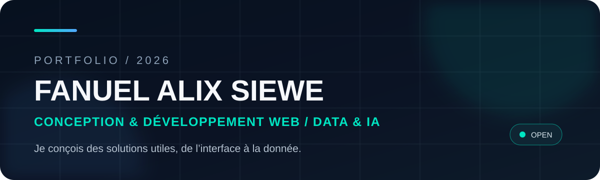

<p align="center">
  
</p>

<p align="center">
  <a href="https://portfoliosiewealix.netlify.app"></a>
  <a href="https://www.linkedin.com/in/alix-siewe-4007b0269/"></a>
  <a href="mailto:siewealix@gmail.com"></a>
</p>

## À propos

Je conçois et développe des solutions web en m'intéressant particulièrement à la manière dont les **données**, l'**automatisation** et l'**intelligence artificielle** peuvent enrichir une application.

Mon parcours couvre l'analyse du besoin, la conception d'interfaces, le développement web, les API, les bases de données, les tests, le déploiement et le travail collaboratif.

🎓 **Bac+5 INSTA** - Directeur de projet en conception et développement de solutions informatiques, 2026-2028  
🎯 **Recherche** - Alternance / stage en conception & développement web, Data ou IA  
🗓️ **Rythme** - 3 semaines en entreprise / 1 semaine en formation

---

## Selected work

<table>
<tr>
<td width="50%" valign="top">

### 🧠 [Risk Monitor](https://github.com/siewealix/risk-monitor)

Outil Data & IA de détection et de suivi de profils à risque à partir de données opérationnelles.

**Ce que le projet démontre**
- exploration et nettoyage de données
- feature engineering et scoring explicable
- interface opérateur avec Streamlit
- assistance IA avec journalisation
- exécution locale avec Docker

`Python` `Pandas` `Streamlit` `SQLite` `OpenAI API` `Docker`

</td>
<td width="50%" valign="top">

### ♻️ [SecondLife Market](https://github.com/siewealix/secondlifemarket)

Marketplace web de vente d'objets d'occasion avec architecture front/back, sécurité et fonctionnalités IA.

**Ce que le projet démontre**
- API ASP.NET Core et frontend React
- authentification JWT + refresh token
- messagerie temps réel avec SignalR
- analyse IA des annonces
- gestion des rôles et workflows métier

`React` `ASP.NET Core` `EF Core` `MySQL` `SignalR` `OpenAI API`

</td>
</tr>
<tr>
<td width="50%" valign="top">

### ✉️ [Assistant intelligent de gestion des e-mails](https://github.com/siewealix/assistant-mails)

Application de consultation, résumé et traitement d'e-mails Gmail avec automatisation et génération de réponses assistées par IA.

**Ce que le projet démontre**
- intégration Gmail API et OAuth
- workflows n8n
- génération de résumés et réponses
- interface React
- structuration et sauvegarde des données

`React` `n8n` `Gmail API` `Groq` `OAuth` `JSON`

</td>
<td width="50%" valign="top">

### 🏠 [Gestion Appartement](https://github.com/siewealix/gestion_appart)

Application de gestion locative avec suivi des opérations, génération de documents et logique métier structurée.

**Ce que le projet démontre**
- architecture MVC
- gestion de données relationnelles
- sécurité des formulaires et sessions
- export CSV / PDF

`PHP` `MVC` `MySQL / MariaDB` `Dompdf`

</td>
</tr>
</table>

> Je préfère montrer quelques projets solides et expliqués plutôt qu'une longue liste de dépôts sans contexte.

---

## Expérience technique

### EXOCOMS Group - Développeur Odoo / E-commerce, stagiaire
**04/2026 - 06/2026**

Développement en binôme d'une application e-commerce spécialisée dans la vente de véhicules de marques chinoises avec **Odoo 19**.

- analyse des besoins liés au catalogue, aux véhicules, aux commandes et au parcours client
- configuration et personnalisation du module e-commerce Odoo
- structuration du catalogue et personnalisation des vues / templates
- configuration des rôles et droits d'accès
- tests fonctionnels, versionnage GitHub et déploiement via Odoo SH

`Odoo 19` `Python` `PostgreSQL` `XML / QWeb` `JavaScript` `GitHub` `Odoo SH`

### IFPGEC_VD22 - Chef de projet junior & Développeur Web, stagiaire
**04/2022 - 06/2022**

Expérience mêlant prospection, recueil du besoin, cahier des charges et réalisation d'un site vitrine pour un commerce local.

- identification de clients potentiels et échanges terrain
- analyse du besoin et formalisation du cahier des charges
- réalisation et mise en ligne d'un site vitrine avec Wix
- initiation à VB.NET, à l'électronique et aux systèmes de vidéosurveillance

---

## Ma façon de travailler

```text
Comprendre le besoin
        ↓
Structurer les données et les flux
        ↓
Concevoir une solution simple et maintenable
        ↓
Développer et tester
        ↓
Documenter, déployer, améliorer
```

Je cherche surtout à produire des solutions **compréhensibles, utiles et démontrables**, avec une attention particulière à la qualité du code, à la traçabilité des décisions et à l'expérience utilisateur.

---

<details>
<summary><strong>🧰 Toolbox technique</strong></summary>
<br />

### Développement web
`JavaScript` `TypeScript` `React` `HTML` `CSS` `Node.js` `Express.js` `C#` `.NET / ASP.NET Core` `PHP`

### Data & IA
`Python` `Pandas` `Jupyter` `Streamlit` `SQL` `OpenAI API` `Groq` `Data Quality` `Feature Engineering` `Scoring`

### Bases de données
`PostgreSQL` `MySQL / MariaDB` `SQLite` `SQL Server` `MongoDB`

### Automatisation, DevOps & qualité
`Git` `GitHub` `GitLab CI/CD` `Docker` `Linux / Shell` `Cron` `SSH` `n8n` `Postman` `xUnit` `Vitest`

### Conception & méthodes
`UML` `Merise` `MVC` `MVVM` `Agile` `Scrum` `Analyse fonctionnelle` `Documentation technique`

### En cours d'acquisition dans mon Bac+5
`Data Engineering` `Machine Learning` `Big Data` `Cloud` `MLOps` `Kubernetes`

</details>

---

## GitHub activity

<p align="center">
  
  
</p>

---

## Contact

Je suis ouvert aux opportunités d'**alternance** ou de **stage** autour de la conception et du développement web, de la Data et de l'IA.

- 🌐 Portfolio : [portfoliosiewealix.netlify.app](https://portfoliosiewealix.netlify.app)
- 💼 LinkedIn : [alix-siewe-4007b0269](https://www.linkedin.com/in/alix-siewe-4007b0269/)
- ✉️ Email : [siewealix@gmail.com](mailto:siewealix@gmail.com)

<p align="center"><strong>Build useful things. Understand the data. Improve the system.</strong></p>
